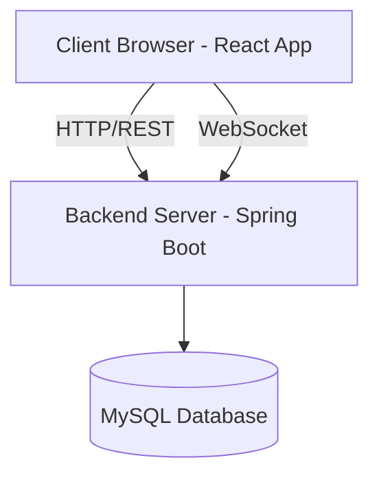
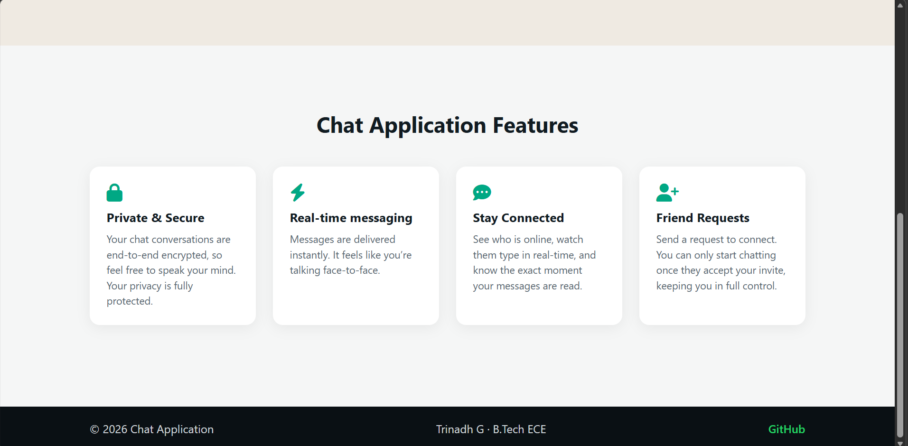

# ChatApp - Real-Time Messaging Platform

A full-stack real-time chat application built with React and Spring Boot, featuring WebSocket messaging, JWT authentication, friend management, and file sharing.

## Table of Contents

| Section                              | Description                             |
| ------------------------------------ | --------------------------------------- |
| [Live Demo](#live-demo)              | Deployed application links              |
| [Features](#features)                | Real-time messaging, Auth, File Sharing |
| [Tech Stack](#tech-stack)            | React, Spring Boot, WebSocket, MySQL    |
| [Architecture](#architecture)        | System design & Data flow diagrams      |
| [Structure](#project-structure)      | Codebase organization & modules         |
| [Getting Started](#getting-started)  | Setup guide for Backend & Frontend      |
| [API Docs](#api-documentation)       | REST Endpoints & Usage                  |
| [WebSocket](#websocket-events)       | Real-time event payloads & topics       |
| [Screenshots](#screenshots)          | App preview on Desktop & Mobile         |
| [Contributing](#contributing)        | Guidelines for contributing             |

## Live Demo

The application is deployed and live at the following links:

* **Frontend Application:** [Live Frontend URL](https://real-time-chat-app-eta-roan.vercel.app/)
* **Backend API Server:** [Live Backend URL](https://real-time-chat-app-hxla.onrender.com)

> [!NOTE]
> Since the backend is deployed on a free hosting tier, i.e., Render, the server may spin down after periods of inactivity. If you experience a delay during your initial request, please wait 30–60 seconds for the backend services to spin back up.

## Features

### Core Functionality

- **JWT Authentication** - Secure login/registration with token-based auth
- **Real-Time Messaging** - Instant message delivery via WebSocket (STOMP)
- **Friend Management** - Send/accept/decline friend requests
- **File Sharing** - Upload and share images, documents, and files
- **Read Receipts** - Message status tracking (sent/delivered/read)
- **Typing Indicators** - See when contacts are typing
- **Online Status** - Real-time presence tracking with last seen timestamps
- **Responsive Design** - WhatsApp-style mobile UI with panel switching
- **Message Management** - Delete messages and conversations
- **User Profiles** - Avatars and profile management
- **Notifications** - Audio alerts and unread badges
- **Search** - Find contacts quickly

## Tech Stack

### Frontend

| Technology          | Purpose                             |
| ------------------- | ----------------------------------- |
| **React 18**        | UI framework with hooks and context |
| **React Router v6** | Client-side routing                 |
| **Vite**            | Build tool and dev server           |
| **CSS Modules**     | Component-scoped styling            |
| **Axios**           | HTTP client for REST API calls      |
| **STOMP.js**        | WebSocket protocol over SockJS      |
| **SockJS Client**   | WebSocket fallback support          |

### Backend

| Technology           | Purpose                            |
| -------------------- | ---------------------------------- |
| **Spring Boot 3.x**  | Java application framework         |
| **Spring WebSocket** | WebSocket support with STOMP       |
| **Spring Security**  | JWT authentication & authorization |
| **Spring Data JPA**  | Database ORM                       |
| **MySQL**            | Primary database                   |
| **Lombok**           | Boilerplate reduction              |
| **Jackson**          | JSON serialization                 |

## Architecture

### System Architecture



### Frontend Architecture

```text
src/
├── components/
│   ├── auth/              # Login, Register pages
│   │   ├── Login.jsx         → Email/password login form with JWT auth
│   │   └── Register.jsx      → New user registration form
│   ├── chat/              # Core chat interface components
│   │   ├── ChatApp.jsx       → Root chat layout, contact list & chat panel
│   │   ├── ChatArea.jsx      → Scrollable message history container
│   │   ├── ChatHeader.jsx    → Contact name, status & action menu (kebab)
│   │   ├── CustomAudioPlayer.jsx → In-chat audio message player
│   │   ├── DateHeader.jsx    → Date divider between message groups
│   │   ├── MessageBubble.jsx → Individual message with timestamp & read status
│   │   ├── MessageInput.jsx  → Text input bar with file attachment & send
│   │   └── WelcomeScreen.jsx → Placeholder shown when no chat is selected
│   ├── common/            # Shared utility components
│   │   ├── PrivateRoute.jsx  → Route guard that redirects unauthenticated users
│   │   └── Toast.jsx         → Dismissible notification/toast popup
│   ├── landing/           # Public marketing pages
│   │   ├── LandingPage.jsx   → Root landing page wrapper
│   │   ├── Hero.jsx          → Hero section with headline & CTA
│   │   ├── Features.jsx      → Feature cards grid
│   │   ├── Footer.jsx        → Page footer with links
│   │   └── Navbar.jsx        → Top navigation bar with login/register links
│   ├── modals/            # Overlay modal dialogs
│   │   ├── AddFriendModal.jsx   → Email input to send a friend request
│   │   ├── ConfirmModal.jsx     → Generic confirm/cancel dialog (used for clear chat)
│   │   ├── LogoutModal.jsx      → Logout confirmation dialog
│   │   ├── MediaModal.jsx       → Full-screen media/image viewer
│   │   ├── RequestsModal.jsx    → Incoming friend requests list
│   │   └── SettingsModal.jsx    → User profile & password update
│   └── sidebar/           # Contact list sidebar
│       ├── Sidebar.jsx       → Full sidebar with contacts & hamburger menu
│       ├── SearchBar.jsx     → Contact search input
│       └── UserItem.jsx      → Single contact row with avatar & last message
│
├── context/               # React Context for global state
│   ├── AuthContext.jsx       → User auth state & JWT token
│   ├── ChatContext.jsx       → Chat-specific shared state
│   └── WebSocketContext.jsx  → STOMP connection & subscriptions
│
├── services/              # API service layer (Axios)
│   ├── api.js                → Axios instance with JWT interceptor
│   ├── authService.js        → Login, register, status endpoints
│   ├── chatService.js        → Message CRUD & clear chat operations
│   ├── fileService.js        → File upload handling
│   └── friendService.js      → Friend requests & contacts
│
├── utils/
│   ├── constants.js          → App-wide constants
│   ├── dateFormatter.js      → Format timestamps (Today/Yesterday/Time)
│   └── fileHelpers.js        → File type detection, size formatting
│
└── App.jsx                # Root component with routing
```

### Backend Architecture

```text
src/main/java/com/chatapp/
├── config/
│   ├── SecurityConfig.java       → JWT filter chain, CORS & stateless session config
│   └── WebSocketConfig.java      → STOMP broker endpoint & allowed origins setup
│
├── controller/
│   ├── ChatController.java       → WebSocket message handling & chat REST endpoints
│   ├── FileController.java       → File upload & static file serving endpoints
│   └── UserController.java       → Auth, friend management & user settings endpoints
│
├── entity/
│   ├── Friendship.java           → JPA entity for friend relationships & status
│   ├── Message.java              → JPA entity for chat messages with file support
│   └── User.java                 → JPA entity for user profiles & online status
│
├── repository/
│   ├── FriendshipRepository.java → JPA queries for friend lookups & status filters
│   ├── MessageRepo.java          → JPA queries for conversation history & unread counts
│   └── UserRepository.java       → JPA queries for user lookup by email
│
├── security/
│   ├── JwtAuthFilter.java        → Intercepts requests & validates Bearer JWT token
│   └── JwtUtil.java              → Token generation, parsing & validation
│
├── service/
│   ├── FilesStorageService.java  → Handles file save, retrieval & deletion on disk
│   └── UserDetailsServiceImpl.java → Loads user by email for Spring Security auth
│
└── ChatApplication.java          → Spring Boot entry point (@SpringBootApplication)
```

## Project Structure

```text
chatapp/
├── frontend/                     # React application
│   ├── public/
│   │   ├── audio/                # Notification sounds
│   │   └── image/                # Static assets (logo, avatars)
│   ├── src/
│   │   ├── components/           # React components
│   │   ├── context/              # Global state management
│   │   ├── services/             # API service layer
│   │   ├── utils/                # Helper functions
│   │   ├── App.jsx               # Root component
│   │   ├── App.css               # Root component styles
│   │   ├── main.jsx              # React entry point
│   │   └── index.css             # Global styles
│   ├── package.json
│   ├── vite.config.js            # Vite configuration + proxy
│   └── index.html
│
└── backend/                              # Spring Boot application
    ├── src/main/java/com/chatapp/
    │   ├── config/                       # Security, WebSocket, CORS config
    │   ├── controller/                   # REST & WebSocket controllers
    │   ├── entity/                       # Database entities
    │   ├── repository/                   # JPA repositories
    │   ├── security                      # Jwt security
    │   ├── service/                      # Business logic
    │   └── ChatAppApplication.java       # Spring Boot main class
    ├── src/main/resources/
    │   ├── application.properties        # DB config, JWT secret, server port
    ├── uploads/                          # Uploaded files storage
    └──pom.xml                            # Maven dependencies
```

## Getting Started

### Prerequisites

- Node.js 18+ and npm
- Java 17+
- MySQL 8.0+
- Maven 3.8+

### Backend Setup

1. Clone the repository:
   ```bash
   git clone https://github.com/TrinadhGorrela/real-time-chat-app.git
   cd chatapp/backend
   ```
2. Create MySQL database:
   ```sql
   CREATE DATABASE chatapp;
   ```
3. Configure `application.properties`:

   ```properties
   # Database
   spring.datasource.url=jdbc:mysql://localhost:3306/chatapp
   spring.datasource.username=root
   spring.datasource.password=your_password
   spring.jpa.hibernate.ddl-auto=update

   # JWT
   jwt.secret=your-256-bit-secret-key
   jwt.expiration=86400000

   # File Upload
   spring.servlet.multipart.max-file-size=10MB
   file.upload.dir=./uploads

   # Server
   server.port=8081
   ```

4. Build and run:
   ```bash
   mvn clean install
   mvn spring-boot:run
   ```
   Backend runs on `http://localhost:8081`

### Frontend Setup

1. Navigate to frontend:
   ```bash
   cd ../frontend
   ```
2. Install dependencies:
   ```bash
   npm install
   ```
3. Start dev server:
   ```bash
   npm run dev
   ```
   Frontend runs on `http://localhost:3000`

## API Documentation

### Authentication Endpoints

| Method | Endpoint                        | Description                        | Auth Required |
| ------ | ------------------------------- | ---------------------------------- | ------------- |
| POST   | `/chatapp/adduser`              | Register new user                  | No            |
| POST   | `/chatapp/validateuser`         | Login user                         | No            |
| GET    | `/chatapp/status/check/{email}` | Get user online status & last seen | Yes           |
| POST   | `/chatapp/update-password`      | Update account password            | Yes           |
| POST   | `/chatapp/update-name`          | Update display name                | Yes           |

### Chat Endpoints

| Method | Endpoint                            | Description             | Auth Required |
| ------ | ----------------------------------- | ----------------------- | ------------- |
| GET    | `/chatapp/messages/{user1}/{user2}` | Get chat history        | Yes           |
| DELETE | `/chatapp/message/{id}`             | Delete a message        | Yes           |
| POST   | `/chatapp/clear-chat`               | Clear full conversation | Yes           |

### Friend Endpoints

| Method | Endpoint                  | Description            | Auth Required |
| ------ | ------------------------- | ---------------------- | ------------- |
| POST   | `/chatapp/request`        | Send friend request    | Yes           |
| GET    | `/chatapp/requests`       | Get pending requests   | Yes           |
| POST   | `/chatapp/accept`         | Accept friend request  | Yes           |
| POST   | `/chatapp/decline`        | Decline friend request | Yes           |
| GET    | `/chatapp/mycontacts`     | Get contact list       | Yes           |
| POST   | `/chatapp/delete-contact` | Remove a contact       | Yes           |

### File Endpoints

| Method | Endpoint                     | Description   | Auth Required |
| ------ | ---------------------------- | ------------- | ------------- |
| POST   | `/files/upload`              | Upload file   | Yes           |
| GET    | `/files/download/{filename}` | Download file | Yes           |

## WebSocket Events

### Client → Server

| Destination             | Payload                        | Description      |
| ----------------------- | ------------------------------ | ---------------- |
| `/app/chat`             | `MessageDTO`                   | Send a message   |
| `/app/chat.typing`      | `{sender, receiver, isTyping}` | Typing indicator |
| `/app/chat.readMessage` | `{sender, receiver, status}`   | Read receipt     |

### Server → Client

| Topic                       | Payload                       | Description                 |
| --------------------------- | ----------------------------- | --------------------------- |
| `/topic/private/{email}`    | `MessageDTO`                  | Incoming messages           |
| `/topic/typing/{email}`     | `{sender, isTyping}`          | Typing status               |
| `/topic/status`             | `{email, isOnline, lastSeen}` | Online status               |
| `/user/queue/read-receipts` | `{id, status}`                | Read receipt acknowledgment |

## Screenshots

### Home Page

<p float="left">
  
</p>

### Features

<p float="left">
  
</p>

### Login & Register

<p float="left">
  
  
</p>

### Chat Interface

<p float="left">
  
  
</p>

### Chat Options

<p float="left">
  
</p>

### Modals

<p float="left">
  
  
</p>

## Contributing

1. Fork the repository
2. Create a feature branch (`git checkout -b feature/amazing-feature`)
3. Commit changes (`git commit -m 'Add amazing feature'`)
4. Push to branch (`git push origin feature/amazing-feature`)
5. Open a Pull Request

## Author

**Siva Satya Trinadh Gorrela**

- **Email:** [trinadh.gorrela2004@gmail.com](mailto:trinadh.gorrela2004@gmail.com)
- **LinkedIn:** [Siva Satya Trinadh Gorrela](https://www.linkedin.com/in/trinadhgorrela/)
- **GitHub:** [@TrinadhGorrela](https://github.com/TrinadhGorrela)
