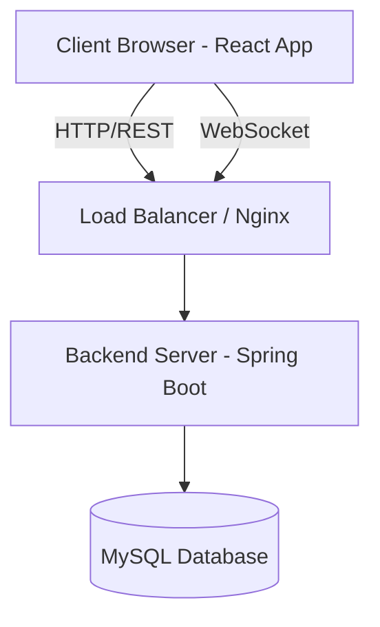

# ChatApp - Real-Time Messaging Platform

A full-stack real-time chat application built with React and Spring Boot, featuring WebSocket messaging, JWT authentication, friend management, and file sharing.

## Table of Contents
|                Section                  |               Description               |
|-----------------------------------------|-----------------------------------------|
| [Features](#-features)                  | Real-time messaging, Auth, File Sharing |
| [Tech Stack](#-tech-stack)              | React, Spring Boot, WebSocket, MySQL    |
| [Architecture](#-architecture)          | System design & Data flow diagrams      |
| [Structure](#-project-structure)        | Codebase organization & modules         |
| [Getting Started](#-getting-started)    | Setup guide for Backend & Frontend      |
| [API Docs](#-api-documentation)         | REST Endpoints & Usage                  |
| [WebSocket](#-websocket-events)         | Real-time event payloads & topics       |
| [Screenshots](#-screenshots)            | App preview on Desktop & Mobile         |
| [Contributing](#-contributing)          | Guidelines for contributing             |

## Features

### Core Functionality
- **JWT Authentication** - Secure login/registration with token-based auth
- **Real-Time Messaging** - Instant message delivery via WebSocket (STOMP)
- **Friend Management** - Send/accept/decline friend requests
- **File Sharing** - Upload and share images, documents, and files
- **Read Receipts** - Message status tracking (sent/delivered/read)
- **Typing Indicators** - See when contacts are typing
- **Online Status** - Real-time presence tracking with last seen timestamps
- **Responsive Design** - WhatsApp-style mobile UI with panel switching
- **Message Management** - Delete messages and conversations
- **User Profiles** - Avatars and profile management
- **Notifications** - Audio alerts and unread badges
- **Search** - Find contacts quickly

## Tech Stack

### Frontend
|     Technology      |             Purpose                 |
|---------------------|-------------------------------------|
| **React 18**        | UI framework with hooks and context |
| **React Router v6** | Client-side routing                 |
| **Vite**            | Build tool and dev server           |
| **CSS Modules**     | Component-scoped styling            |
| **Axios**           | HTTP client for REST API calls      |
| **STOMP.js**        | WebSocket protocol over SockJS      |
| **SockJS Client**   | WebSocket fallback support          |

### Backend
|      Technology     |            Purpose                 |
|---------------------|------------------------------------|
| **Spring Boot 3.x** | Java application framework         |
| **Spring WebSocket**| WebSocket support with STOMP       |
| **Spring Security** | JWT authentication & authorization |
| **Spring Data JPA** | Database ORM                       |
| **MySQL**           | Primary database                   |
| **Lombok**          | Boilerplate reduction              |
| **Jackson**         | JSON serialization                 |

## Architecture

### System Architecture


### Frontend Architecture
```text
src/
├── components/
│   ├── auth/              # Login, Register, PrivateRoute
│   ├── chat/              # ChatApp, ChatArea, ChatHeader, MessageBubble, MessageInput
│   ├── sidebar/           # Sidebar, UserItem, SearchBar
│   ├── navigation/        # NavStrip, ProfileMenu
│   ├── modals/            # AddFriendModal, RequestsModal, ConfirmModal
│   ├── common/            # Toast, DateHeader, WelcomeScreen
│   └── landing/           # LandingPage, Hero, Features, Footer
│
├── context/               # React Context for global state
│   ├── AuthContext.jsx       → User auth state & JWT token
│   ├── WebSocketContext.jsx  → STOMP connection & subscriptions
│   └── ChatContext.jsx       → Chat-specific shared state
│
├── services/              # API service layer (Axios)
│   ├── api.js                → Axios instance with JWT interceptor
│   ├── authService.js        → Login, register, status endpoints
│   ├── chatService.js        → Message CRUD operations
│   ├── friendService.js      → Friend requests & contacts
│   └── fileService.js        → File upload handling
│
├── utils/
│   ├── dateFormatter.js      → Format timestamps (Today/Yesterday/Time)
│   ├── fileHelpers.js        → File type detection, size formatting
│   └── constants.js          → App-wide constants
│
└── App.jsx                # Root component with routing
```

### Backend Architecture
```text
src/main/java/com/chatapp/
├── controller/
│   ├── AuthController.java        → /chatapp/adduser, /validateuser, /status/*
│   ├── ChatController.java        → /chatapp/messages, /chatapp/history
│   ├── FriendController.java      → /chatapp/friends/*
│   ├── FileController.java        → /files/upload, /files/download
│   └── WebSocketController.java   → @MessageMapping endpoints
│
├── service/
│   ├── AuthService.java           → JWT generation, user validation
│   ├── ChatService.java           → Message persistence & retrieval
│   ├── FriendService.java         → Friend request logic
│   ├── FileService.java           → File storage handling
│   └── StatusService.java         → Online/offline tracking
│
├── repository/
│   ├── UserRepository.java
│   ├── MessageRepository.java
│   └── FriendRequestRepository.java
│
├── entity/
│   ├── User.java                  → @Entity with JPA annotations
│   ├── Message.java
│   └── FriendRequest.java
│
├── config/
│   ├── WebSocketConfig.java      → STOMP endpoint setup
│   ├── SecurityConfig.java       → JWT filter, CORS config
│   └── JwtUtil.java              → Token generation/validation
│
└── dto/                           → Data Transfer Objects
    ├── LoginRequest.java
    ├── MessageDTO.java
    └── FriendRequestDTO.java
```

## Project Structure

```text
chatapp/
├── frontend/                      # React application
│   ├── public/
│   │   ├── image/                # Static assets (logo, avatars)
│   │   └── audio/                # Notification sounds
│   ├── src/
│   │   ├── components/           # React components
│   │   ├── context/              # Global state management
│   │   ├── services/             # API service layer
│   │   ├── utils/                # Helper functions
│   │   ├── App.jsx               # Root component
│   │   ├── main.jsx              # React entry point
│   │   └── index.css             # Global styles
│   ├── package.json
│   ├── vite.config.js            # Vite configuration + proxy
│   └── index.html
│
└── backend/                       # Spring Boot application
    ├── src/main/java/com/chatapp/
    │   ├── controller/           # REST & WebSocket controllers
    │   ├── service/              # Business logic
    │   ├── repository/           # JPA repositories
    │   ├── entity/               # Database entities
    │   ├── config/               # Security, WebSocket, CORS config
    │   └── dto/                  # Data Transfer Objects
    ├── src/main/resources/
    │   ├── application.properties    # DB config, JWT secret, server port
    │   └── static/                   # Uploaded files storage
    ├── pom.xml                       # Maven dependencies
    └── ChatAppApplication.java      # Spring Boot main class
```

## Getting Started

### Prerequisites
- Node.js 18+ and npm
- Java 17+
- MySQL 8.0+
- Maven 3.8+

### Backend Setup
1. Clone the repository:
   ```bash
   git clone <your-repo-url>
   cd chatapp/backend
   ```
2. Create MySQL database:
   ```sql
   CREATE DATABASE chatapp;
   ```
3. Configure `application.properties`:
   ```properties
   # Database
   spring.datasource.url=jdbc:mysql://localhost:3306/chatapp
   spring.datasource.username=root
   spring.datasource.password=your_password
   spring.jpa.hibernate.ddl-auto=update

   # JWT
   jwt.secret=your-256-bit-secret-key
   jwt.expiration=86400000

   # File Upload
   spring.servlet.multipart.max-file-size=10MB
   file.upload.dir=./uploads

   # Server
   server.port=8081
   ```
4. Build and run:
   ```bash
   mvn clean install
   mvn spring-boot:run
   ```
   Backend runs on `http://localhost:8081`

### Frontend Setup
1. Navigate to frontend:
   ```bash
   cd ../frontend
   ```
2. Install dependencies:
   ```bash
   npm install
   ```
3. Start dev server:
   ```bash
   npm run dev
   ```
   Frontend runs on `http://localhost:3000`

## API Documentation

### Authentication Endpoints
| Method | Endpoint                        | Description         | Auth Required |
|--------|---------------------------------|---------------------|---------------|
| POST   | `/chatapp/adduser`              | Register new user   | No            |
| POST   | `/chatapp/validateuser`         | Login user          | No            |
| POST   | `/chatapp/status/online`        | Mark user online    | Yes           |
| POST   | `/chatapp/status/offline`       | Mark user offline   | Yes           |
| GET    | `/chatapp/status/check/{email}` | Get user status     | Yes           |

### Chat Endpoints
| Method | Endpoint                                | Description      | Auth Required |
|--------|-----------------------------------------|------------------|---------------|
| GET    | `/chatapp/messages/{sender}/{receiver}` | Get chat history | Yes           |
| DELETE | `/chatapp/messages/{id}`                | Delete message   | Yes           |

### Friend Endpoints
| Method | Endpoint                             | Description            | Auth Required |
|--------|--------------------------------------|------------------------|---------------|
| POST   | `/chatapp/friends/request`           | Send friend request    | Yes           |
| GET    | `/chatapp/friends/requests/pending`  | Get pending requests   | Yes           |
| POST   | `/chatapp/friends/accept`            | Accept friend request  | Yes           |
| POST   | `/chatapp/friends/decline`           | Decline friend request | Yes           |
| GET    | `/chatapp/friends/contacts`          | Get friend list        | Yes           |
| DELETE | `/chatapp/friends/{email}`           | Delete friend          | Yes           |

### File Endpoints
| Method |          Endpoint              | Description   | Auth Required |
|--------|--------------------------------|---------------|---------------|
| POST   | `/files/upload`                | Upload file   | Yes           |
| GET    | `/files/download/{filename}`   | Download file | Yes           |

## WebSocket Events

### Client → Server
| Destination             |          Payload               | Description          |
|-------------------------|--------------------------------|----------------------|
| `/app/chat`             | `MessageDTO`                   | Send a message       |
| `/app/chat.typing`      | `{sender, receiver, isTyping}` | Typing indicator     |
| `/app/chat.readMessage` | `{sender, receiver, status}`   | Read receipt         |

### Server → Client
|         Topic                 |          Payload              | Description                 |
|-------------------------------|-------------------------------|-----------------------------|
| `/topic/private/{email}`      | `MessageDTO`                  | Incoming messages           |
| `/topic/typing/{email}`       | `{sender, isTyping}`          | Typing status               |
| `/topic/status`               | `{email, isOnline, lastSeen}` | Online status               |
| `/user/queue/read-receipts`   | `{id, status}`                | Read receipt acknowledgment |

## Screenshots

### Home
<p float="left">
  
</p>

### Login & Register
<p float="left">
  
   
</p>

### Chat Interface
<p float="left">
  
</p>

##  Contributing
1. Fork the repository
2. Create a feature branch (`git checkout -b feature/amazing-feature`)
3. Commit changes (`git commit -m 'Add amazing feature'`)
4. Push to branch (`git push origin feature/amazing-feature`)
5. Open a Pull Request

## Author

**Siva Satya Trinadh Gorrela**
- **Email:** [trinadh.gorrela2004@gmail.com](mailto:trinadh.gorrela2004@gmail.com)
- **LinkedIn:** [Siva Satya Trinadh Gorrela](https://www.linkedin.com/in/trinadhgorrela/)
- **GitHub:** [@TrinadhGorrela](https://github.com/TrinadhGorrela)

