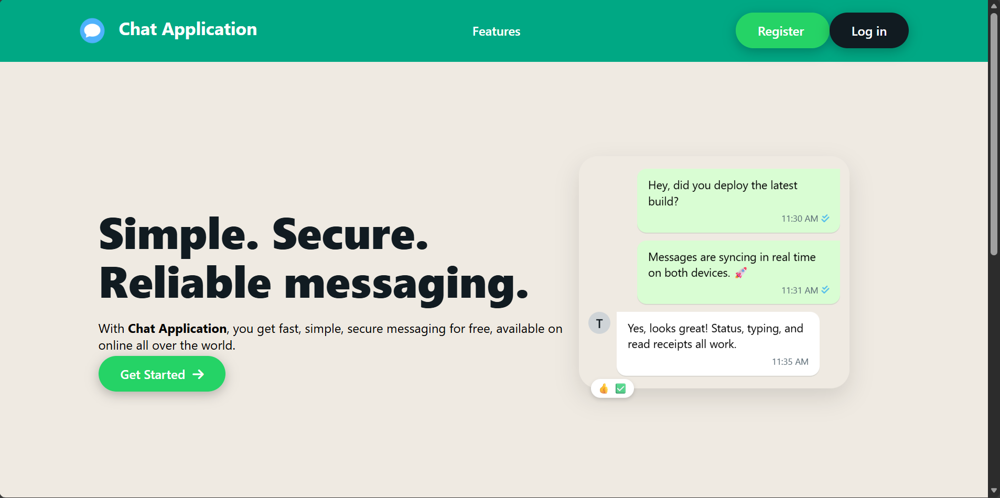
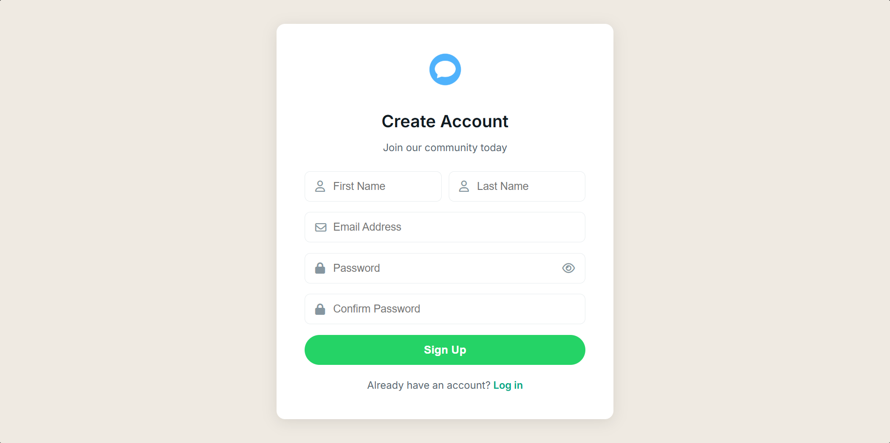
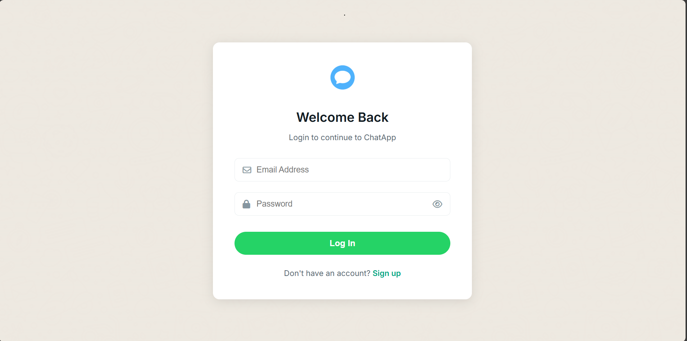

# Real-Time Chat Application 

Full-stack real-time messaging app built during B.Tech project.

## ✨ Features
- Real-time one-to-one chat (WebSocket/STOMP)
- JWT Authentication & Authorization
- Message persistence (MySQL)
- WhatsApp-style UI (HTML/CSS/JS)
- Notification sounds & status (sent/delivered)

## 🛠 Tech Stack
Spring Boot | WebSocket | JWT | MySQL | Maven | HTML/CSS/JS


## 🚀 Quick Start
```bash
mvn spring-boot:run

Register/Login: http://localhost:8081/register or /login

Chat: http://localhost:8081/chat

ChatApp/
├── src/main/java/com/chatapp/
│   ├── controller/     # REST APIs
│   ├── entity/         # User, Message, Friendship
│   ├── service/        # Business logic
│   └── config/         # SecurityConfig, WebSocketConfig
└── src/main/resources/static/  # Frontend HTML/CSS/JS

## API Endpoints
| Method | Endpoint | Description |
|--------|----------|-------------|
| POST | /register | Create user |
| POST | /login | JWT token |
| GET  | /chat | WebSocket |

## Demo Screenshots

**Home Page**


**Register Page**


**Login Page**


**Real-time Chat**


